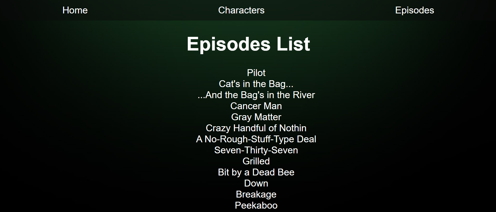

# Breaking Bad

La idea es crear una aplicacion web que consuma datos de una API externa y se muestre en pantalla. A medida que vayamos avanzando iremos incorporando nuevas features.

Podemos consultar la documentación de la API en la siguiente ruta:
`https://www.breakingbadapi.com/documentation`

Por el momento comenzaremos con lo principal. El CSS ya esta echo. Te recomendamos que primero intentes darle funcionabilidad a la APP y luego, si deseas, puedes modificar el CSS.

Trabajaremos en la carpeta /src. Ahi tendremos nuestro /components. Deberiamos seguir el siguiente flujo recomendado:

Recuerden hacer npm install para descargar las dependencias necesarias. Luego necesitaran hacer npm start para revisar su progreso en tiempo real con el navegador. Cualquier duda me contactan

# App.js

Esta es nuestra ruta principal. Aquí tendremos que definir nuestras rutas(el router lo debemos definir en el index) para con las siguientes rutas:

- **"/"** Este sera nuestro Home.
- **"/characters"** Aqui mostraremos una lista de los personajes.
- **"/characters/:id"** Esto nos llevara al detalle de cada personaje.
- **"/episodes"** Aqui mostraremos una lista de los episodios.

# Home

En esta ruta vamos a hacer la llamada a la API que nos devuelve
una quote aleatoria de la serie. Vamos a utilizar esa quote para que cada vez que entremos se muestre una diferente.

Deberia quedar asi:

  

Vamos a abrir el script Home.js en la carpeta /components/home para empezar a codearlo.

# NavBar

Se deberia mostrar en toda la app y nos deberia llevar a otras rutas del sitio. Ya definiremos
estas rutas a continuación.

Ya hay un archivo NavBar.css, que le de algo de formato a la barra, vamos a trabajar con ese.

# Characters

Ahora definamos el componente Characters, que debe aparecer al entrar en "/characters". Para eso abrimos el script Characters.js, en la carpeta /components/characters. En este script hay que tomar la ruta de la api que devuelve la lista de personajes.
Ademas deberia tener una searchbar que nos permita buscar personajes.

  

# CharacterDetail

La página va tomando forma. Ahora, cada vez que hacemos click en el nombre de un personaje, debería llevarnos a una página con los detalles de ese personaje. Para eso, podemos usar el hook useParams. Este hook va tomar el id proveniente de la ruta (Por ejemplo: "/characters/5").
Aqui podremos mostrar tantos detalles como querramos. Seamos creativos!!

# Episodes

En la ruta /episodes vamos a mostrar una lista de todos los capítulos de la serie.
La api nos devuelve los capítulos de Better Call Saul también, pero vamos a excluirlos.

  

A travez de todo el repo hay diferentes pista escondidas. Algunas son mas literales, otras no tanto. Presten atencion a los imports!!!

# Extra Credit

Si ya terminaste y queres algo un poco mas desafiante vamos a probar incoporar lo siguiente:

# Deaths

Crea una nueva ruta que muestre las muertes mas iconics de la serie.

# Episodes part 2

Ahora vamos a incorporar una searchbar tambien a este componente y deberia ser capaz de buscar no solo por nombre sino tambien por numero de episodio.

# Paginacion

Ahora vamos a limitar la cantidad de elementos que mostramos en pantalla a 10. El resto lo vamos a mostrar en siguientes paginas.
Para ello vas a tener que investigar un poco mas. Veamos que tan bueno somos googleando...

Pista: podes usar los endpoint Limit & Offset.

GOOD CODING!
